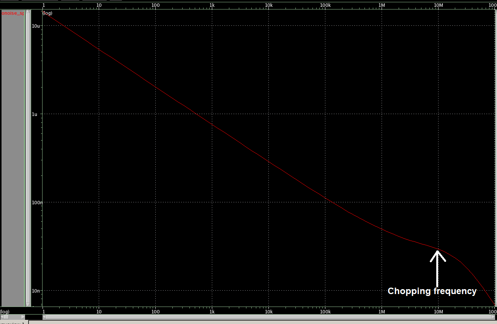

# SSCS PICO project (USA-1) - novel flicker noise cancellation technique in SKY130 technology

## table of contents
1. Project description
2. Schematic and test setup 
3. Layout (til date)
4. Noise simulation

1. Project Description
A flicker noise cancellation technique using bias-switching technique is proposed. In this scheme instead of chopping the input, the effective Gm is switched from +Gm to -Gm periodically by switching bias current. This has several benefits over traditional chopping technique such as:
1. The input stays high impedance and there is no need to have a driver or buffer to connect to such circuit block.
2. The chopping glitches and transients are all common mode and hence chopping artifacts is reduced.
3. A continuous time signal can be passed through such circuit block without sampling. For example proposed Gm can be used for Gm-C integrator and hence benefit from sampling at the output of the Gm-C integrator and hence reducing input referred kT/C noise.
4. Allows for trading power for reducing flicker noise. Conventionally only device size can be increased to reduce the flicker noise. Increasing current increases flicker noise in conventional design.

Figure below shows the schematic of the proposed flicker noise cancelled Gm in pushpull structure.
  

2. Schematics and test setup
Figure below shows the schematic of gm\_noflicker cell

Figure below shows the schematic of non-overlapping clock generator

Figure below shows the schematic of the test bench

3. Layout
Figure below shows the layout of clkgen (completed)

Figure below shows the layout of gm_noflicker cell (work in progress)

4. Noise simulation
  The devices were sized such that at chopping frequency a 2pF load can be driven (this is an assumption, not sure how much load will be there in pcb. Might have to add a LNA or buffer). Also made sure that noise corner is below the chopping frequency. Bias current is 100uA each. Figure below shows the noise simulation results.

Due to the way the noise is modeled, this scheme couldn't not be verified completely in PNOISE simulation in different process technology. Also only partial cancellation shows up in Transient Noise simulation. Hence we wanted to test in real Silicon if the flicker noise cancellation works. Therefore no other simulation is planned. At the same time ngspice cannot be used to run transient noise simulation. We tried to export the spice models into Cadence environment, however due to differences in ngspice format and hspice format, we were not able to do that as well.
  So we plan on just making sure we can drive the load and hence see the noise corner without chopping and be able to see the 1/f slope go away with chopping. Only operating point simulation and noise simulation was run to make sure devices are in proper operating region.

